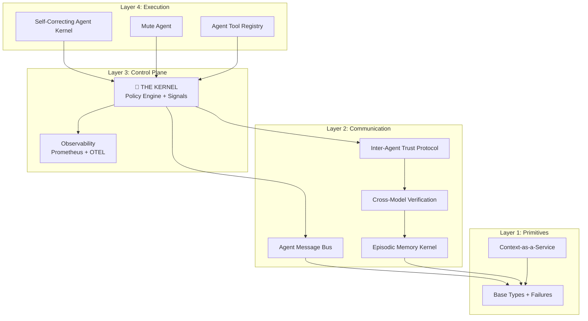

<div align="center">

# Agent OS

**A kernel architecture for governing autonomous AI agents**

[](https://github.com/imran-siddique/agent-os/stargazers)
[](https://github.com/sponsors/imran-siddique)
[](LICENSE)
[](https://python.org)
[](https://github.com/imran-siddique/agent-os/actions/workflows/ci.yml)
[](https://marketplace.visualstudio.com/items?itemName=agent-os.agent-os-vscode)
[](https://imran-siddique.github.io/agent-os-docs/)

> ⭐ **If this project helps you, please star it!** It helps others discover Agent OS.

[Quick Start](#quick-example) • [Documentation](https://imran-siddique.github.io/agent-os-docs/) • [VS Code Extension](https://marketplace.visualstudio.com/items?itemName=agent-os.agent-os-vscode) • [Examples](examples/)

<br/>

[](https://gitpod.io/#https://github.com/imran-siddique/agent-os)

*Try Agent OS instantly in your browser - no installation required*

</div>

---

<p align="center">
  
</p>

---

## 🎯 What You'll Build in 5 Minutes

```python
from agent_os import KernelSpace, Policy

# 1. Define safety policies (not prompts - actual enforcement)
kernel = KernelSpace(policies=[
    Policy.no_destructive_sql(),      # Block DROP, DELETE without WHERE
    Policy.file_access("/workspace"), # Restrict file access
    Policy.rate_limit(100, "1m"),     # Max 100 calls/minute
])

# 2. Your agent code runs in user space
@kernel.register
async def data_analyst(query: str):
    result = await llm.generate(f"Analyze: {query}")
    return result

# 3. Kernel intercepts and validates EVERY action
result = await kernel.execute(data_analyst, "revenue by region")
# ✅ Safe queries execute
# ❌ "DROP TABLE users" → BLOCKED (not by prompt, by kernel)
```

**Result:** Defined policies are deterministically enforced by the kernel—not by hoping the LLM follows instructions.

---

## What is Agent OS?

Agent OS applies operating system concepts to AI agent governance. Instead of relying on prompts to enforce safety ("please don't do dangerous things"), it provides application-level middleware that intercepts and validates agent actions before execution.

> **Note:** This is application-level enforcement (Python middleware), not OS kernel-level isolation. Agents run in the same process. For true isolation, run agents in containers.

```
┌─────────────────────────────────────────────────────────┐
│              USER SPACE (Agent Code)                    │
│   Your agent code runs here. The kernel intercepts      │
│   actions before they execute.                          │
├─────────────────────────────────────────────────────────┤
│              KERNEL SPACE                               │
│   Policy Engine │ Flight Recorder │ Signal Dispatch     │
│   Actions are checked against policies before execution │
└─────────────────────────────────────────────────────────┘
```

## The Idea

**Prompt-based safety** asks the LLM to follow rules. The LLM decides whether to comply.

**Kernel-based safety** intercepts actions before execution. The policy engine decides, not the LLM.

This is the same principle operating systems use: applications request resources, the kernel grants or denies access based on permissions.

---

## Architecture



### Directory Structure

```
agent-os/
├── src/agent_os/             # Core Python package
│   ├── __init__.py           # Public API
│   ├── cli.py                # Command-line interface
│   └── integrations/         # Framework adapters
├── modules/                  # Kernel Modules (4-layer architecture)
│   ├── primitives/           # Layer 1: Base types and failures
│   ├── cmvk/                 # Layer 1: Cross-model verification
│   ├── emk/                  # Layer 1: Episodic memory kernel
│   ├── caas/                 # Layer 1: Context-as-a-Service
│   ├── amb/                  # Layer 2: Agent message bus
│   ├── iatp/                 # Layer 2: Inter-agent trust protocol
│   ├── atr/                  # Layer 2: Agent tool registry
│   ├── observability/        # Layer 2: Prometheus + OpenTelemetry
│   ├── control-plane/        # Layer 3: THE KERNEL (policies, signals)
│   ├── scak/                 # Layer 4: Self-correcting agent kernel
│   ├── mute-agent/           # Layer 4: Face/Hands architecture
│   └── mcp-kernel-server/    # Integration: MCP protocol support
├── extensions/               # IDE & AI Assistant Extensions
│   ├── mcp-server/           # ⭐ MCP Server (Copilot, Claude, Cursor)
│   ├── vscode/               # VS Code extension
│   ├── copilot/              # GitHub Copilot (DEPRECATED - use mcp-server)
│   ├── jetbrains/            # IntelliJ/PyCharm plugin
│   ├── cursor/               # Cursor IDE extension
│   ├── chrome/               # Chrome extension
│   └── github-cli/           # gh CLI extension
├── examples/                 # Working examples
│   ├── quickstart/           # Start here: my_first_agent.py
│   ├── demo-app/             # Full demo application
│   ├── hello-world/          # Minimal example
│   └── [domain examples]/    # Real-world use cases
├── docs/                     # Documentation
├── tests/                    # Test suite (organized by layer)
├── notebooks/                # Jupyter tutorials
└── templates/                # Policy templates
```

---

## Core Modules

| Module | Layer | Description |
|--------|-------|-------------|
| [`primitives`](modules/primitives/) | 1 | Base types and failure modes |
| [`cmvk`](modules/cmvk/) | 2 | Cross-model verification (consensus across LLMs) |
| [`amb`](modules/amb/) | 2 | Agent message bus (decoupled communication) |
| [`iatp`](modules/iatp/) | 2 | Inter-agent trust protocol (sidecar-based) |
| [`emk`](modules/emk/) | 2 | Episodic memory kernel (append-only ledger) |
| [`control-plane`](modules/control-plane/) | 3 | **THE KERNEL** - Policy engine, signals, VFS |
| [`observability`](modules/observability/) | 3 | Prometheus metrics + OpenTelemetry tracing |
| [`scak`](modules/scak/) | 4 | Self-correcting agent kernel |
| [`mute-agent`](modules/mute-agent/) | 4 | Decoupled reasoning/execution architecture |
| [`atr`](modules/atr/) | 4 | Agent tool registry (runtime discovery) |
| [`caas`](modules/caas/) | 4 | Context-as-a-Service (RAG routing) |
| [`mcp-kernel-server`](modules/mcp-kernel-server/) | Int | MCP server for Claude Desktop |

---

## IDE & CLI Extensions

| Extension | Description |
|-----------|-------------|
| [`mcp-server`](extensions/mcp-server/) | ⭐ **MCP Server** - Works with Claude, Copilot, Cursor (`npx agentos-mcp-server`) |
| [`vscode`](extensions/vscode/) | VS Code extension with real-time policy checks |
| [`jetbrains`](extensions/jetbrains/) | IntelliJ, PyCharm, WebStorm plugin |
| [`cursor`](extensions/cursor/) | Cursor IDE extension (Composer integration) |
| [`copilot`](extensions/copilot/) | ~~GitHub Copilot safety layer~~ (DEPRECATED - use mcp-server) |
| [`github-cli`](extensions/github-cli/) | `gh agent-os` CLI extension |
| [`chrome`](extensions/chrome/) | Chrome extension for web agents |

---

## Install

```bash
pip install agent-os
```

Or with optional components:

```bash
pip install agent-os[cmvk]           # + cross-model verification
pip install agent-os[iatp]           # + inter-agent trust
pip install agent-os[observability]  # + Prometheus/OpenTelemetry
pip install agent-os[full]           # Everything
```

### One-Command Quickstart

**macOS/Linux:**
```bash
curl -sSL https://raw.githubusercontent.com/imran-siddique/agent-os/main/scripts/quickstart.sh | bash
```

**Windows (PowerShell):**
```powershell
iwr -useb https://raw.githubusercontent.com/imran-siddique/agent-os/main/scripts/quickstart.ps1 | iex
```

---

## Quick Example

```python
from agent_os import KernelSpace

# Create kernel with policy
kernel = KernelSpace(policy="strict")

@kernel.register
async def my_agent(task: str):
    # Your LLM code here
    return llm.generate(task)

# Actions are checked against policies
result = await kernel.execute(my_agent, "analyze this data")
```

---

## POSIX-Inspired Primitives

Agent OS borrows concepts from POSIX operating systems:

| Concept | POSIX | Agent OS |
|---------|-------|----------|
| Process control | `SIGKILL`, `SIGSTOP` | `AgentSignal.SIGKILL`, `AgentSignal.SIGSTOP` |
| Filesystem | `/proc`, `/tmp` | VFS with `/mem/working`, `/mem/episodic` |
| IPC | Pipes (`\|`) | Typed IPC pipes between agents |
| Syscalls | `open()`, `read()` | `kernel.execute()` |

### Signals

```python
from agent_os import SignalDispatcher, AgentSignal

dispatcher.signal(agent_id, AgentSignal.SIGSTOP)  # Pause
dispatcher.signal(agent_id, AgentSignal.SIGCONT)  # Resume
dispatcher.signal(agent_id, AgentSignal.SIGKILL)  # Terminate
```

### VFS (Virtual File System)

```python
from agent_os import AgentVFS

vfs = AgentVFS(agent_id="agent-001")
vfs.write("/mem/working/task.txt", "Current task")
vfs.read("/policy/rules.yaml")  # Read-only from user space
```

---

## Framework Integrations

Wrap existing frameworks with Agent OS governance:

```python
# LangChain
from agent_os.integrations import LangChainKernel
governed = LangChainKernel().wrap(my_chain)

# OpenAI Assistants
from agent_os.integrations import OpenAIKernel
governed = OpenAIKernel().wrap_assistant(assistant, client)

# Semantic Kernel
from agent_os.integrations import SemanticKernelWrapper
governed = SemanticKernelWrapper().wrap(sk_kernel)

# CrewAI
from agent_os.integrations import CrewAIKernel
governed = CrewAIKernel().wrap(my_crew)
```

See [integrations documentation](docs/integrations.md) for full details.

---

## How It Differs from Other Tools

**Agent Frameworks** (LangChain, CrewAI): Build agents. Agent OS governs them. Use together.

**Safety Tools** (NeMo Guardrails, LlamaGuard): Input/output filtering. Agent OS intercepts actions mid-execution.

| Tool | Focus | When it acts |
|------|-------|--------------|
| LangChain/CrewAI | Building agents | N/A (framework) |
| NeMo Guardrails | Input/output filtering | Before/after LLM call |
| LlamaGuard | Content classification | Before/after LLM call |
| **Agent OS** | Action interception | During execution |

You can use them together:

```python
from langchain.agents import AgentExecutor
from agent_os import KernelSpace

kernel = KernelSpace(policy="strict")

@kernel.govern
async def my_langchain_agent(task: str):
    return agent_executor.invoke({"input": task})
```

---

## Examples

The `examples/` directory contains working demos:

### Getting Started

| Demo | Description | Command |
|------|-------------|---------|
| [hello-world](examples/hello-world/) | Simplest example (15 lines) | `cd examples/hello-world && python agent.py` |
| [chat-agent](examples/chat-agent/) | Interactive chatbot with memory | `cd examples/chat-agent && python chat.py` |
| [tool-using-agent](examples/tool-using-agent/) | Agent with safe tools | `cd examples/tool-using-agent && python agent.py` |

### Production Demos (with Observability)

| Demo | Description | Command |
|------|-------------|---------|
| [carbon-auditor](examples/carbon-auditor/) | Multi-model verification | `cd examples/carbon-auditor && docker-compose up` |
| [grid-balancing](examples/grid-balancing/) | Multi-agent coordination (100 agents) | `cd examples/grid-balancing && docker-compose up` |
| [defi-sentinel](examples/defi-sentinel/) | Real-time attack detection | `cd examples/defi-sentinel && docker-compose up` |
| [pharma-compliance](examples/pharma-compliance/) | Document analysis | `cd examples/pharma-compliance && docker-compose up` |

Each production demo includes:
- **Grafana dashboard** on port 300X
- **Prometheus metrics** on port 909X  
- **Jaeger tracing** on port 1668X

```bash
# Run carbon auditor with full observability
cd examples/carbon-auditor
cp .env.example .env  # Optional: add API keys
docker-compose up

# Open dashboards
open http://localhost:3000  # Grafana (admin/admin)
open http://localhost:16686 # Jaeger traces
```

---

## Safe Tool Plugins

Agent OS includes pre-built safe tools for agents:

```python
from atr.tools.safe import create_safe_toolkit

toolkit = create_safe_toolkit("standard")

# Available tools
http = toolkit["http"]        # Rate-limited HTTP with domain whitelisting
files = toolkit["files"]      # Sandboxed file reader
calc = toolkit["calculator"]  # Safe math (no eval)
json = toolkit["json"]        # Safe JSON/YAML parsing
dt = toolkit["datetime"]      # Timezone-aware datetime
text = toolkit["text"]        # Text processing

# Use a tool
result = await http.get("https://api.github.com/users/octocat")
```

See [Creating Custom Tools](docs/tutorials/custom-tools.md) for more.

---

## Message Bus Adapters

Connect agents using various message brokers:

```python
from amb_core.adapters import RedisBroker, KafkaBroker, NATSBroker

# Redis (low latency)
broker = RedisBroker(url="redis://localhost:6379")

# Kafka (high throughput)
broker = KafkaBroker(bootstrap_servers="localhost:9092")

# NATS (cloud-native)
broker = NATSBroker(servers=["nats://localhost:4222"])

# Also: AzureServiceBusBroker, AWSSQSBroker
```

See [Message Bus Adapters Guide](docs/tutorials/message-bus-adapters.md) for details.

---

## CLI Tool

Agent OS includes a CLI for terminal workflows:

```bash
# Check files for safety violations
agentos check src/app.py

# Check staged git files (pre-commit)
agentos check --staged

# Multi-model code review
agentos review src/app.py --cmvk

# Install git pre-commit hook
agentos install-hooks

# Initialize Agent OS in project
agentos init
```

---

## MCP Integration (Claude Desktop, GitHub Copilot, Cursor)

Agent OS provides an MCP server that works with any MCP-compatible AI assistant:

```bash
# Quick install via npx
npx agentos-mcp-server
```

**npm:** [`agentos-mcp-server`](https://www.npmjs.com/package/agentos-mcp-server)  
**MCP Registry:** `io.github.imran-siddique/agentos`

Add to your config file:

**Claude Desktop** (`%APPDATA%\Claude\claude_desktop_config.json` on Windows):
```json
{
  "mcpServers": {
    "agentos": {
      "command": "npx",
      "args": ["-y", "agentos-mcp-server"]
    }
  }
}
```

**Features:** 10 tools for agent creation, policy enforcement, compliance checking (SOC 2, GDPR, HIPAA), human-in-the-loop approvals, and audit logging.

See [MCP server documentation](extensions/mcp-server/README.md) for full details.

---

## Documentation

### Tutorials
- [5-Minute Quickstart](docs/tutorials/5-minute-quickstart.md) - Get running fast
- [30-Minute Deep Dive](docs/tutorials/30-minute-deep-dive.md) - Comprehensive walkthrough
- [Building Your First Governed Agent](docs/tutorials/first-governed-agent.md) - Complete tutorial
- [Using Message Bus Adapters](docs/tutorials/message-bus-adapters.md) - Connect agents
- [Creating Custom Tools](docs/tutorials/custom-tools.md) - Build safe tools
- [Cheatsheet](docs/cheatsheet.md) - Quick reference

### Interactive Notebooks
Learn by doing with Jupyter notebooks:

| Notebook | Description | Time |
|----------|-------------|------|
| [Hello Agent OS](notebooks/01-hello-agent-os.ipynb) | Your first governed agent | 5 min |
| [Episodic Memory](notebooks/02-episodic-memory-demo.ipynb) | Agent memory that persists | 15 min |
| [Time-Travel Debugging](notebooks/03-time-travel-debugging.ipynb) | Replay and debug decisions | 20 min |
| [Cross-Model Verification](notebooks/04-cross-model-verification.ipynb) | Detect hallucinations | 15 min |
| [Multi-Agent Coordination](notebooks/05-multi-agent-coordination.ipynb) | Trust between agents | 20 min |
| [Policy Engine](notebooks/06-policy-engine.ipynb) | Deep dive into policies | 15 min |

### Reference
- [Quickstart Guide](docs/quickstart.md) - 60 seconds to first agent
- [Framework Integrations](docs/integrations.md) - LangChain, OpenAI, etc.
- [Kernel Internals](docs/kernel-internals.md) - How the kernel works
- [Architecture Overview](docs/architecture.md) - System design
- [CMVK Algorithm](docs/cmvk-algorithm.md) - Cross-model verification
- [RFC-003: Agent Signals](docs/rfcs/RFC-003-Agent-Signals.md) - POSIX-style signals
- [RFC-004: Agent Primitives](docs/rfcs/RFC-004-Agent-Primitives.md) - Core primitives

---

## Status

This is a research project exploring kernel concepts for AI agent governance. The code is functional but evolving.

### Core (Production-Ready)
The minimal trust boundary that's small enough to audit:
- **Policy Engine**: Deterministic rule enforcement for defined patterns
- **Flight Recorder**: SQLite-based audit logging (see known limitations below)
- **SDK Adapters**: Intercept tool calls at SDK boundary (OpenAI, LangChain, CrewAI)

### Extensions (Experimental)
Additional capabilities built on the core:
- Cross-model verification (CMVK), Inter-agent trust (IATP)
- Supervisor agents, Constraint graphs, Shadow mode
- IDE extensions (VS Code, JetBrains, Copilot)
- Observability (Prometheus, OpenTelemetry)
- Message bus adapters (Redis, Kafka, NATS)

### Known Architectural Limitations
Be aware of these design constraints:

| Limitation | Impact | Mitigation |
|------------|--------|------------|
| **Application-level only** | Direct stdlib calls (subprocess, open) bypass kernel | Pair with container isolation for production |
| **Blocklist-based policies** | Novel attack patterns not in rules will pass | Add AST-level parsing (#32), use defense in depth |
| **Shadow Mode single-step** | Multi-step agent simulations diverge from reality | Use for single-turn validation only |
| **No tamper-proof audit** | Flight Recorder SQLite can be modified by compromised agent | Write to external sink for critical audits |
| **Provider-coupled adapters** | Each SDK needs separate adapter | Abstract interface planned (#47) |

See [GitHub Issues](https://github.com/imran-siddique/agent-os/issues) for the full roadmap.
- Some integrations are basic wrappers

---

## Troubleshooting

### Common Issues

**ModuleNotFoundError: No module named 'agent_os'**
```bash
# Install from source
git clone https://github.com/imran-siddique/agent-os.git
cd agent-os
pip install -e .
```

**Permission errors on Windows**
```bash
# Run PowerShell as Administrator, or use --user flag
pip install --user -e .
```

**Docker not working**
```bash
# Build with Dockerfile (no Docker Compose needed for simple tests)
docker build -t agent-os .
docker run -it agent-os python examples/hello-world/agent.py
```

**Tests failing with API errors**
```bash
# Most tests work without API keys - mock mode is default
pytest tests/ -v

# For real LLM tests, set environment variables
export OPENAI_API_KEY=sk-...
export ANTHROPIC_API_KEY=sk-ant-...
```

---


## Contributing

```bash
git clone https://github.com/imran-siddique/agent-os.git
cd agent-os
pip install -e ".[dev]"
pytest
```

---

## License

MIT - See [LICENSE](LICENSE)

---

<div align="center">

**Exploring kernel concepts for AI agent safety.**

[GitHub](https://github.com/imran-siddique/agent-os) · [Docs](docs/)

</div>
